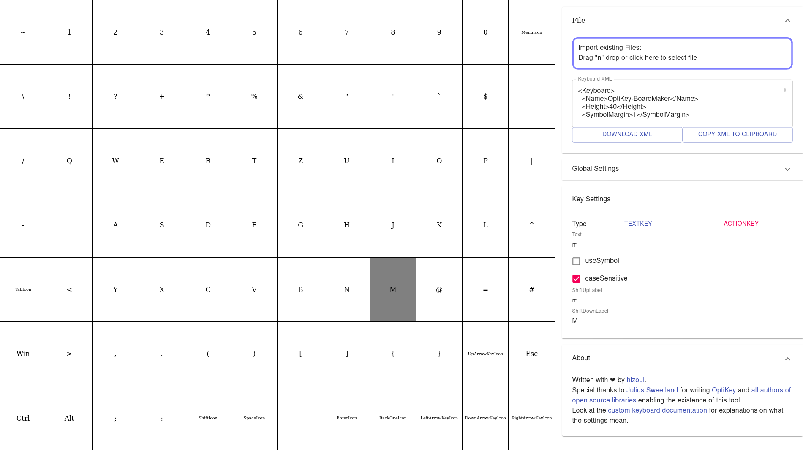

# Optikey-BoardLayout
Optikey-Boardlayout is a small tool to visually edit a [custom keyboard layout](https://github.com/OptiKey/OptiKey/wiki/Creating-and-Using-Dynamic-Keyboards) for [OptiKey](http://www.optikey.org/).
You can use it [in your browser here](http://hizoul.github.io/optikey-boardlayout) without installing anything :)

# Credits
Special thanks go out to [Julius Sweetland](https://github.com/JuliusSweetland) for programming [OptiKey](http://www.optikey.org/) and [all the developers of the open source packages](https://github.com/hizoul/optikey-boardlayout/blob/master/License.3rdparty) this software is built upon.

# Screenshot
